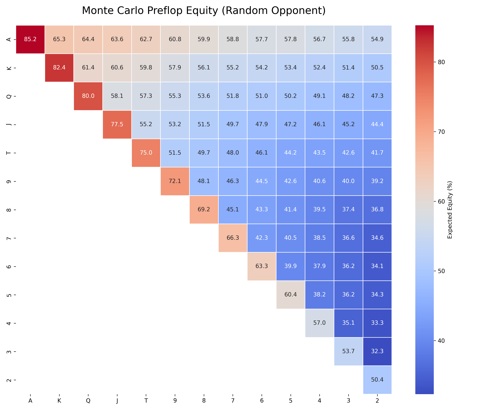

# ♠️ Ultra-Low-Latency Monte Carlo Engine

A high-performance Texas Hold'em Monte Carlo equity calculator and game theory pipeline built in **C++17** and **Python**. 

Designed with a focus on high-frequency quantitative systems architecture, this engine bypasses standard array-based hand evaluation in favor of 64-bit integer bitboards, achieving a throughput of over **46 Million hand evaluations per second**.

## 🚀 Architectural Highlights

* **64-Bit Bitboard Evaluation:** Represents standard 52-card decks, hole cards, and community boards as single `uint64_t` integers. Hand strengths are evaluated using hardware-level bitwise operations (e.g., `__builtin_popcountll`) and bit-shifting, completely eliminating array traversal overhead.
* **Zero-Allocation Memory Pool:** The deck architecture utilizes a static, stack-allocated O(1) "Swap-and-Pop" array. The hot loop features absolutely zero heap allocations (`new`/`delete`), preventing OS-level latency spikes.
* **High-Speed RNG (`xoshiro256++`):** Replaced standard `std::mt19937` with `xoshiro256++`, a state-of-the-art PRNG utilizing pure bitwise operations (XOR, shifts, addition) with a microscopic 32-byte state footprint to keep the L1 cache hot.
* **32-Bit Hexadecimal Scoring:** Hand ranks and kickers are compressed into a single 32-bit hexadecimal integer (`0xRABCDE`), allowing the CPU to resolve complex tie-breakers in a single mathematical comparison.

## 📊 The Data Pipeline (C++ to Python)

The engine computes the absolute expected equity of all **169 unique starting poker hands** against a random opponent. It simulates 1,000,000 runouts per hand (169,000,000 total simulated hands) and exports the data matrix to a CSV. 

A Python data-visualization script (`pandas`, `seaborn`) ingests the C++ output to generate a professional Game Theory Optimal (GTO) expected value heatmap.



## 🗂️ Repository Structure

```text
monte-carlo-sim/
├── CMakeLists.txt
├── include/
│   ├── Bitboard.h       
│   ├── Constants.h      
│   ├── Deck.h           
│   ├── Evaluator.h      
│   ├── RNG.h            
│   └── Simulator.h      
├── src/
│   ├── Deck.cpp
│   ├── Evaluator.cpp
│   ├── main.cpp         
│   └── Simulator.cpp
└── scripts/
    └── visualize_poker.py
```

## ⚙️ Build and Execution Instructions

This project uses CMake and requires a compiler that supports C++17. It is optimized with `-O3` and `-march=native` flags for maximum hardware sympathy.

**1. Build the C++ Engine:**
```bash
mkdir build && cd build
cmake ..
make
```
